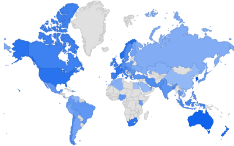

# Google Trends about drones and UAVs

**Query url**: [Click me](https://trends.google.com/trends/explore?date=all&q=%2Fm%2F0g2bc,uas,dji,drone)

## How to extract geoMap from Google Trends?

- First, inspect geochart by clicking it (Inspect or ``CTRL+Mayus+I``).
- Second, go through the element till reach svg node, copy as element and paste it into a new file (``*.svg``)
- Thrid, use any svg2pdf online tool. In my case, I used [this one](https://documento.online-convert.com/es/convertir/svg-a-pdf)
